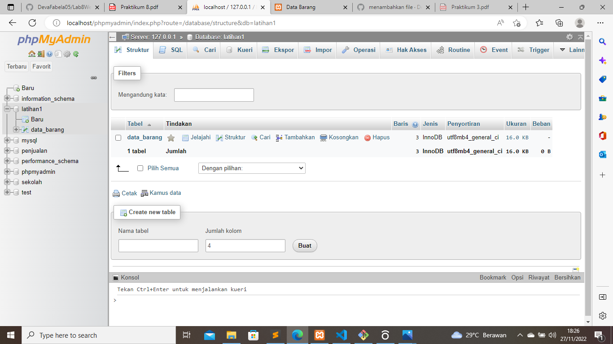
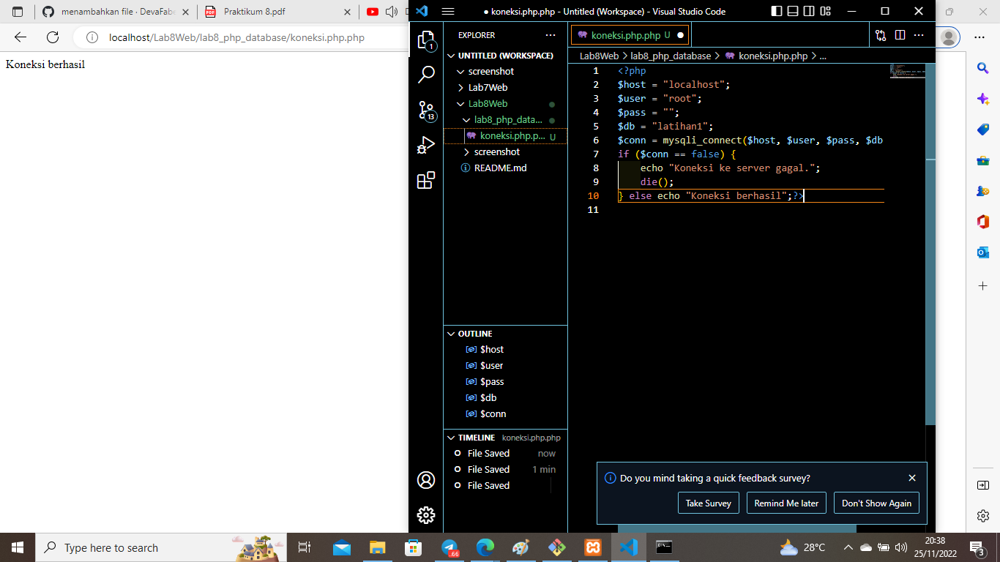
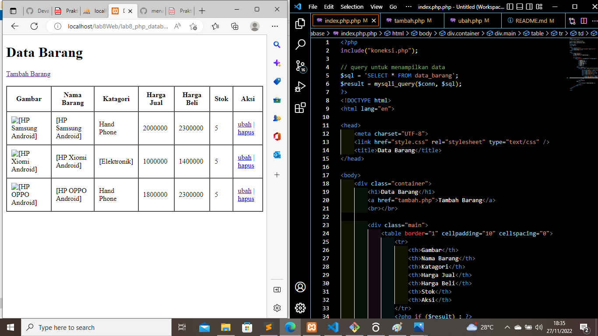

# Lab8Web# Lab7Web

## PHP Dan Database MySQL

### Langkah - langkah Pratikum 8

#### membuat folder lab8_php_database

Dengan mengaktifkan xampp terlebih dahulu untuk menyalakan aphace dan mysql, lalu kemudian membuat folder baru dengan nama lab8_php_database pada root directory web server (c:\xampp\htdocs). dan bisa di cek melalui http://localhost/lab8_php_database/ pada google chrome maupun mozila. Beginilah tampilannya:

#### Membuat Database

membuat Database pada Mysql dengan nama latihan1 dan membuat tabel data_barang. kemudian menambahkan data pada tabel data_barang Inilah tampilannya:

#### Membuat tabel dan menambahkan data

membuat Database pada Mysql dengan nama latihan1 dan membuat tabel data_barang. kemudian menambahkan data pada tabel data_barang Inilah tampilannya:

#### Membuat Program CRUD

Sebelumnya pastikan xampp sudah aktif dan sudah membuat folder lab8_php_database pada (c:xampp/htdocs).

#### Membuat file koneksi database

Untuk mengconnectkan file di database Pastikan Database sudah terbuat dan buat syntax yang hubungkan user dan db. Buka melalui browser untuk menguji koneksi database (untuk menyampilkan pesan koneksi berhasil, uncomment pada perintah echo “koneksi berhasil”. berikut tampilannya :

#### Membuat file index untuk menampilkan data (Read)

Membuat file dengan nama index.php pastikan databse sudah terconnect dengan program kemudian tambahkan query untuk menampilkan data dengan SELECT \* FROM data_barang. dan pastikan nama yang di masukan sama dengan nama tabel pada database. Berikut tampilannya:

#### Menambah Data (Create)

Membuat form untuk menambahkan data dan connectkan dengan koneksi.php dan index.php agar pada saat klik tambah barang maka otomatis langsung muncul from tambah barang. Berikut tampilannya:

#### Mengubah Data (Update)

Dengan mengklik ubah pada kolom aksi maka otomatis akan langsung pada form yang pilih untuk di ubah. Berikut ini adalah tampilannya:

#### Menghapus Data (Delete)

Dengan mengklik hapus pada kolom aksi, maka akan muncul opsi apakah yakin untuk di hapus jika iya akan otomatis data terhapus. Berikut ini adalah tampilannya:

#### Menampilkan hasil

Ini lah hasil pratikum 8 saya. Berikut ini adalah tampilannya:

